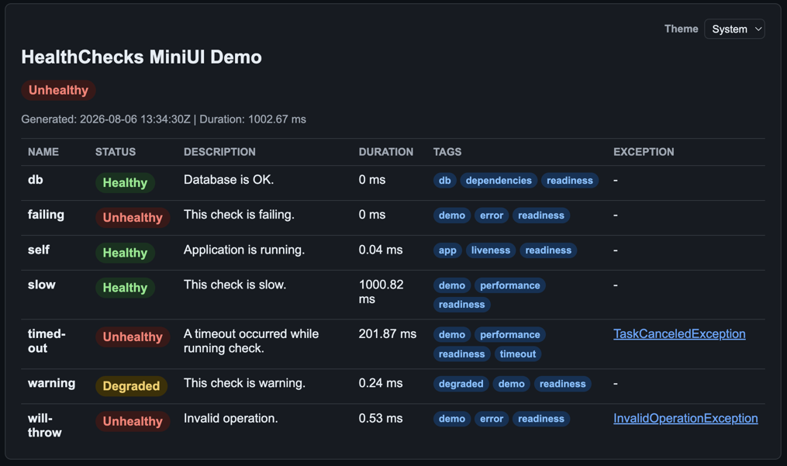
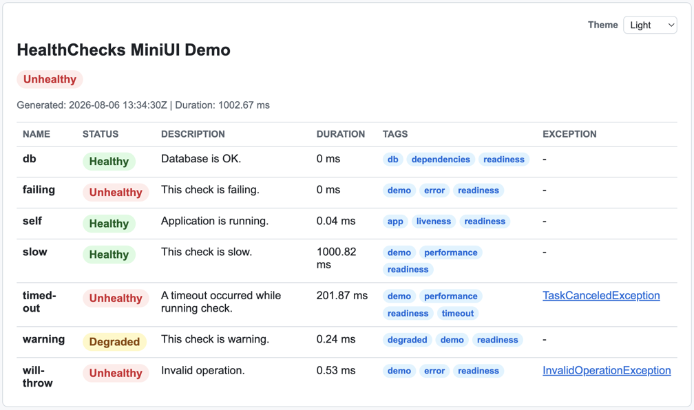
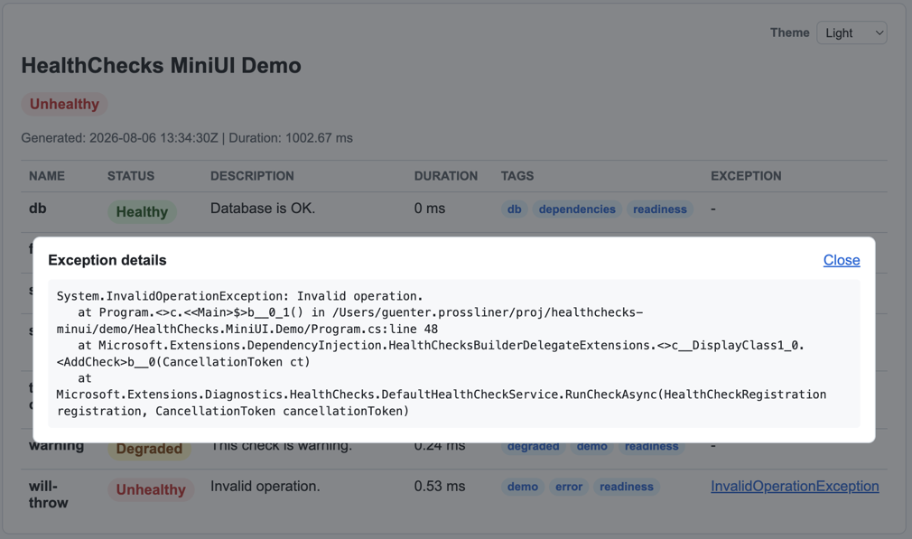

# HealthChecks.MiniUI

HealthChecks.MiniUI is a tiny ASP.NET Core health page helper that renders a human-friendly HTML status page on top of Microsoft health checks.

## What it does

- Keeps your machine endpoint separate from the human UI
- Renders health checks as a simple HTML page
- Shows status, description, duration, tags, and exception details
- Uses the existing Microsoft health check pipeline

## How it looks

These screenshots are taken from the demo application.

| Dark mode | Light mode | Exception pop-out |
| --- | --- | --- |
|  |  |  |

## Installation

Install the package from NuGet:

```bash
dotnet add package WorldDirect.HealthChecks.MiniUI
```

## Basic usage

Map the page in your app startup code:

```csharp
// Microsoft.Extensions.HealthChecks
app.MapHealthChecks("/healthz");

// MiniUI HealthCheck page
app.MapSimpleHealthPage("/health-ui", options =>
{
    options.Title = "My App Health";
});
```

## Response status codes

By default, the page returns HTTP `200` for all overall health states (`Healthy`, `Degraded`, `Unhealthy`).

You can override this per status:

```csharp
using Microsoft.AspNetCore.Http;

app.MapSimpleHealthPage("/health-ui", options =>
{
    options.StatusCodes.Healthy = StatusCodes.Status200OK;
    options.StatusCodes.Degraded = StatusCodes.Status200OK;
    options.StatusCodes.Unhealthy = StatusCodes.Status503ServiceUnavailable;
});
```

## Filtering which checks are executed

By default the page executes all registered health checks. Use `Predicate` to select a subset, for example by tag. Checks that are filtered out are not executed at all:

```csharp
app.MapSimpleHealthPage("/health-ui", options =>
{
    options.Predicate = registration => registration.Tags.Contains("ui");
});
```

This is the same `Func<HealthCheckRegistration, bool>` shape as `HealthCheckOptions.Predicate` used by `MapHealthChecks`.

## Example for dynamic response

If you want a single entry URL, you can dispatch based on the Accept header:
Browsers typically include `text/html` on page navigation, so interactive users will see the UI automatically.

- `/health` with `Accept: text/html` -> MiniUI endpoint (`/health-ui`)
- `/health` with other Accept values -> machine endpoint (`/healthz`)

```csharp
// Custom Middleware for Accept header based routing
app.Use(async (context, next) =>
{
    if (context.Request.Path == "/health")
    {
        var accept = context.Request.Headers.Accept.ToString();
        var wantsHtml = accept.Contains("text/html", StringComparison.OrdinalIgnoreCase);

        // Internal server-side rewrite for this request (no 3xx redirect to the client).
        context.Request.Path = wantsHtml ? "/health-ui" : "/healthz";
    }

    await next();
});

// Required in this setup so endpoint routing sees the rewritten /health path.
app.UseRouting();

app.MapHealthChecks("/healthz");

app.MapSimpleHealthPage("/health-ui", options =>
{
    options.Title = "My App Health";
});
```

## Demo app

The repository includes a small demo app in `demo/HealthChecks.MiniUI.Demo`.

Run it from the repo root:

```bash
dotnet run --project demo/HealthChecks.MiniUI.Demo/HealthChecks.MiniUI.Demo.csproj
```

Then open:

- `/health` as the dynamic entry URL (UI for browser requests, machine response for non-HTML Accept headers)
- `/health-ui` for the UI endpoint directly
- `/healthz` for the machine endpoint directly

## Notes

- The UI is intentionally small and stateless.
- Route configuration is map-time, matching the usual ASP.NET Core endpoint style.
- The page is designed to stay simple and easy to extend later.
